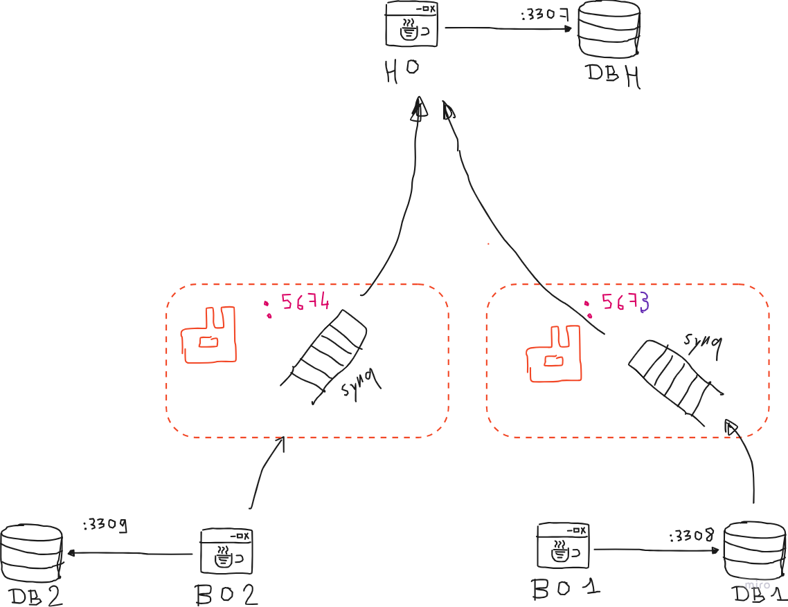

# Rabbit the Synchronizer
Distributed System Project based on Message Broker architecture, with RabbitMQ as the primary implementation and the solution for synchronizing between remote databases .

---

## Prerequisites
Before running the project, ensure you have the following prerequisites installed:
- Java +17
- RabbitMQ 
- MySQL
- Docker
If you are going to use Docker then you don't need to install services like RabbitMQ and MySQL, docker-compose will manage to pull them and start them.
If Docker is not an available option you will have to manage getting 2 rabbitMQ servers, 3 MySQL databases (for 2 Branch Offices, 1 Head Office).

## How to Run
### Starting services With Docker
1. Clone the repository: `git clone https://www.github.com/0marMejdi/Rabbit-the-Synchronizer`
2. Navigate to the project directory: `cd path/to/Rabbit the Synchronizer`
3. Run the Docker Compose command: `docker-compose up`

### Without Docker
1. Clone the repository: `git clone [repository-url]`
2. Navigate to the project directory: `cd project-directory`
3. [Additional steps required to set up environment without Docker]

## Explanation
[Provide a brief explanation of the project, its purpose, and how it works.]

## Diagram

---

Feel free to reach out if you have any questions or need further assistance. Happy coding!
